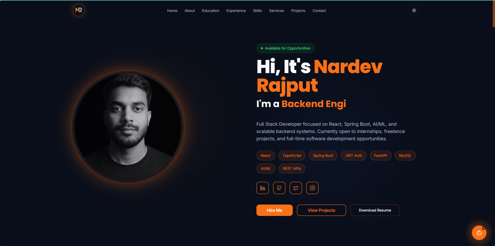
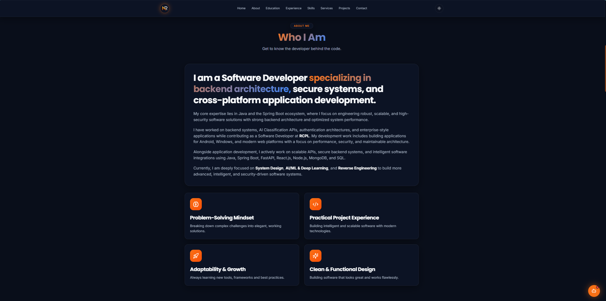
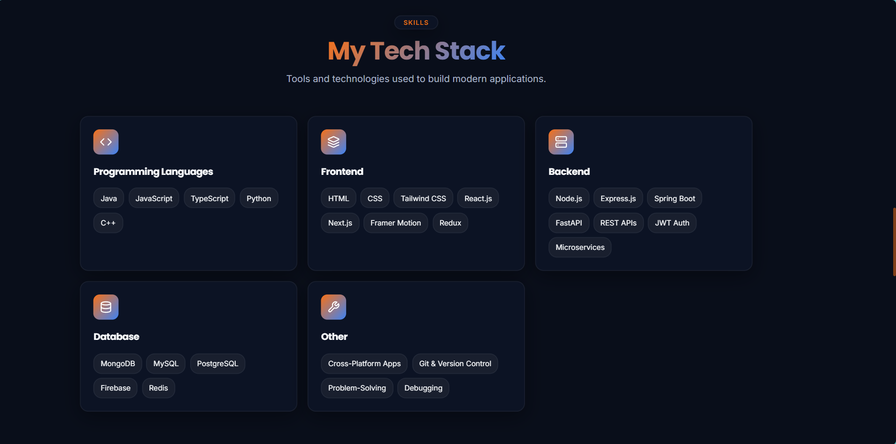
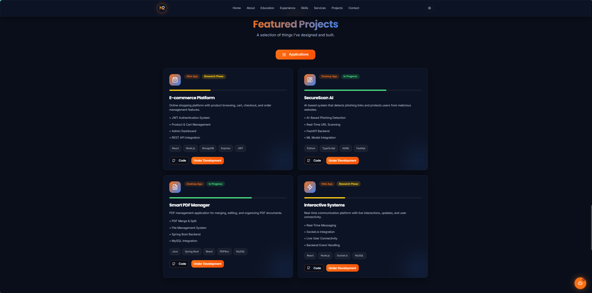
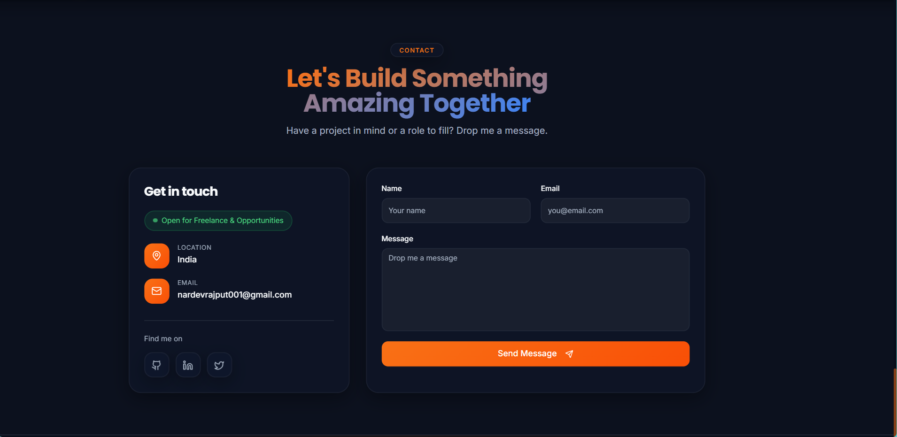

# 🚀 Nardev Rajput | Full Stack Developer Portfolio

A modern, production-ready Full Stack Developer Portfolio built using React.js, TypeScript, Spring Boot, MySQL, JWT Authentication, and modern software engineering practices.

This portfolio showcases my technical skills, projects, experience, certifications, and provides a secure way for recruiters, clients, and organizations to connect with me.

---

# 🌐 Live Demo

### Frontend

https://my-portfolio-two-tan-81.vercel.app

### Backend API

https://nardev-portfolio-backend.onrender.com

---

# 👨‍💻 About The Project

This project is a full-stack developer portfolio designed to demonstrate real-world software development skills rather than functioning as a simple static website.

The application follows modern development practices including:

- Frontend & Backend Separation
- REST API Architecture
- JWT Authentication
- Secure Admin Dashboard
- MySQL Database Integration
- DTO Validation
- Exception Handling
- Rate Limiting
- Responsive Design
- Production-Ready Deployment

The primary goal of this project is to showcase backend-focused full-stack development skills using Java, Spring Boot, React, and modern web technologies.

---

# 👨‍🎓 About Me

## Nardev Rajput

B.Tech Computer Science & Engineering Graduate

Backend-Focused Full Stack Developer specializing in secure backend systems, scalable APIs, and modern web application development.

### Core Skills

- Java
- Spring Boot
- React.js
- TypeScript
- MySQL
- JWT Authentication
- REST APIs
- Docker
- AWS
- Postman
- AI/ML Fundamentals

---

# ✨ Key Features

## Portfolio Features

- Professional Landing Page
- About Section
- Education Timeline
- Experience Timeline
- Skills Showcase
- Services Section
- Featured Projects Section
- Contact Form Integration
- Resume Download
- Social Media Integration
- Fully Responsive Design
- Dark Theme Interface

---

## Frontend Features

- React.js + TypeScript
- Tailwind CSS
- Framer Motion Animations
- Responsive Layout
- Smooth Navigation
- Reusable Components
- Axios API Integration
- Modern UI/UX Design
- Mobile Friendly Interface

---

## Backend Features

- Spring Boot REST APIs
- Layered Architecture
- DTO Pattern
- Request Validation
- Global Exception Handling
- JPA Repository Pattern
- JWT Authentication
- Secure Admin APIs
- Contact Management System
- MySQL Integration
- CORS Configuration
- Rate Limiting

---

# 🔐 Authentication System

The project implements JWT-based authentication for admin access.

### Authentication Flow

1. Admin enters credentials.
2. Spring Security validates credentials.
3. JWT Token is generated.
4. Token is stored securely.
5. Frontend sends Bearer Token.
6. Backend validates token.
7. Protected APIs become accessible.

### Security Benefits

- Stateless Authentication
- Secure Route Protection
- Token-Based Authorization
- Admin-Only Access

---

# 🔒 Security Features

- JWT Authentication
- Spring Security
- Protected Routes
- Bearer Token Authorization
- DTO Validation
- Input Validation
- CORS Protection
- Rate Limiting
- Exception Handling
- Stateless Session Management

---

# 🏗️ System Architecture

User
↓
React Frontend
↓
Axios Requests
↓
Spring Boot REST APIs
↓
Spring Security + JWT
↓
Service Layer
↓
Repository Layer
↓
MySQL Database

---

# 🛠️ Technology Stack

## Frontend

- React.js
- TypeScript
- Tailwind CSS
- Axios
- React Router DOM
- Framer Motion
- Lucide React

---

## Backend

- Java 17
- Spring Boot
- Spring Security
- JWT Authentication
- Spring Data JPA
- Maven

---

## Database

- MySQL

---

## Development Tools

- Git
- GitHub
- VS Code
- IntelliJ IDEA
- Postman
- Docker
- AWS

---

# 📂 Backend Architecture

src/main/java/com/nardev/portfoliobackend

├── config
├── controller
├── dto
├── exception
├── jwt
├── model
├── repository
├── response
├── security
├── service

### Layer Responsibilities

#### Controller Layer

Handles API requests and responses.

#### DTO Layer

Request validation and data transfer.

#### Service Layer

Business logic implementation.

#### Repository Layer

Database operations and persistence.

#### Model Layer

Database entity representation.

#### JWT Layer

Authentication and authorization logic.

#### Config & Security Layer

Security, JWT filters, and CORS configuration.

---

# 📊 Database Design

## contacts Table

| Column  | Type    |
| ------- | ------- |
| id      | Integer |
| name    | String  |
| email   | String  |
| message | Text    |

The table stores all visitor contact submissions.

---

# 🔌 API Endpoints

## Authentication

POST /auth/login

---

## Contact APIs

POST /api/contact

GET /api/contact/admin/contacts

DELETE /api/contact/admin/{id}

---

# 🧠 Backend Functionalities

The backend handles:

- Contact Form Submission
- Contact Storage
- JWT Authentication
- Token Validation
- Secure Admin Access
- Request Validation
- API Response Handling
- Database Persistence
- Security Filtering
- Rate Limiting

---

# 📈 Admin Dashboard

A dedicated admin dashboard has been implemented.

### Dashboard Features

- Secure Login
- View Contact Messages
- Delete Contact Messages
- JWT Protected Access
- Logout Functionality
- Responsive Dashboard Design

---

# 📸 Portfolio Screenshots

## 🏠 Home Section



---

## 👨‍💻 About Section



---

## 🛠️ Skills Section



---

## 🚀 Projects Section



---

## 📬 Contact Section



---

## 🔐 Admin Login

(Add Admin Login Screenshot)

---

## 📊 Admin Dashboard

(Add Admin Dashboard Screenshot)

---

# 🚀 Running Locally

## Frontend

```bash
npm install
npm run dev
```

## Backend

```bash
mvn clean install
mvn spring-boot:run
```

## Database

```sql
CREATE DATABASE portfolio_db;
```

Configure application.properties and start the backend server.

---

# 📬 Contact Information

## Nardev Rajput

📧 Email
[nardevrajput001@gmail.com](mailto:nardevrajput001@gmail.com)

📱 Phone
+91 9027050462

💼 LinkedIn
https://www.linkedin.com/in/nardev-rajput-813a83275/

🐙 GitHub
https://github.com/NardevRajput

🌐 Portfolio
https://my-portfolio-two-tan-81.vercel.app

---

# 🔮 Future Improvements

Planned upgrades:

- AI Portfolio Assistant
- Resume Analyzer
- Blog Module
- Visitor Analytics Dashboard
- Role-Based Authentication
- Cloudinary File Upload
- Docker Deployment
- Redis Caching
- AWS Infrastructure Deployment
- CI/CD Pipeline

---

# 🎯 Project Impact

This project demonstrates:

- Full Stack Development
- Java Backend Development
- Spring Boot Expertise
- React & TypeScript Development
- REST API Design
- JWT Authentication
- Database Design & Integration
- Security Best Practices
- Software Architecture Design
- Production-Level Development Practices

Suitable for:

- Software Developer Roles
- Java Developer Roles
- Backend Developer Roles
- Full Stack Developer Roles
- Internship Opportunities
- Freelance Projects
- Startup MVP Development
- Professional Portfolio Showcase

---

# ⭐ Support

If you found this project useful, please consider giving it a Star ⭐ on GitHub.

Thank you for visiting my portfolio!
